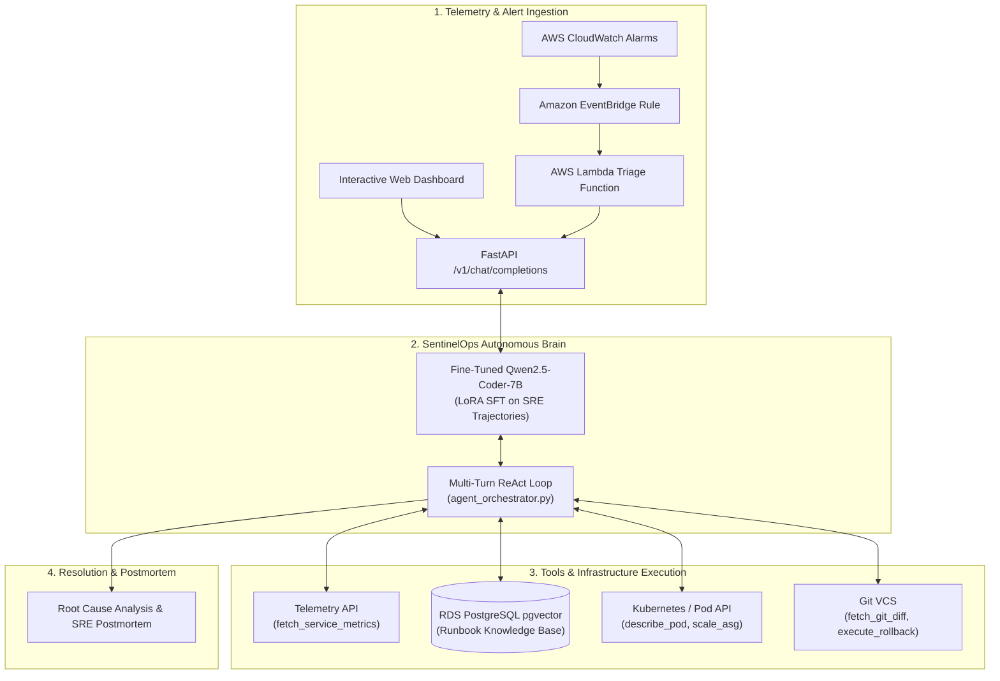

# 🛡️ SentinelOps: Autonomous SRE Incident-Response Agent

[](https://www.python.org/)
[](LICENSE)
[](https://pytorch.org/)
[](https://fastapi.tiangolo.com/)
[](https://aws.amazon.com/)

**SentinelOps** is an autonomous AI Site Reliability Engineer (SRE) agent designed to investigate, triage, and remediate distributed cloud infrastructure incidents in real time. It pairs a specialized fine-tuned 7B LLM (`Qwen/Qwen2.5-Coder-7B-Instruct`) with an event-driven **multi-turn ReAct orchestration engine**, **pgvector RAG runbook retrieval**, an **interactive Web Control Center**, and an **AWS CloudWatch/EventBridge serverless trigger pipeline**.

---

## 📸 Interactive SRE Control Center (Web UI)

SentinelOps includes a modern dark-themed web dashboard and interactive API playground:

- **Web Dashboard URL:** `http://localhost:8000` (or `http://<EC2-PUBLIC-IP>:8000`)
- **Interactive Swagger UI:** `http://localhost:8000/docs`

### Key Web Features:
1. **Interactive Incident Dispatcher**: Test real-world failure modes (`Database Deadlock & High Latency`, `OOM Kill & Cache Eviction`, `Traffic Surge & Kafka Consumer Lag`, or custom telemetry).
2. **Visual ReAct Trajectory**: Real-time trace timeline showing tool arguments and telemetry responses (`fetch_service_metrics` ➔ `query_vector_db` ➔ `execute_rollback`).
3. **Automated Postmortem & RCA**: Generates comprehensive root cause analysis, timeline of actions, and preventive recommendations.

---

## 🏛️ System Architecture



---

## 🚀 Key Capabilities

- **Structured Multi-Turn Tool Calling**: Native function calling with a balanced brace-matching parser that flawlessly extracts complex nested JSON payloads without regex truncation.
- **RAG-Augmented Runbook Retrieval**: Vector similarity lookup against standard operating procedures (SOPs) stored in PostgreSQL with `pgvector`.
- **Autonomous Remediation Safeguards**: Capable of targeted remediation (service rollback, autoscaling group expansion, pod lifecycle management) bounded by safety rules.
- **Full-Stack Cloud Deployment**: Complete Terraform infrastructure-as-code modules for AWS (VPC, EC2 public server, RDS pgvector, EventBridge, Lambda).
- **OpenAI-Compatible Model Server**: Exposes standard `/v1/chat/completions` and `/v1/models` endpoints for drop-in compatibility with existing LLM tooling.

---

## ⚡ Quickstart Guide

### 1. Run the Web Dashboard Locally or on AWS EC2

```bash
# Clone the repository
git clone https://github.com/kyrtyy/SentinelOps.git
cd SentinelOps

# Create and activate virtual environment
python3 -m venv .venv
source .venv/bin/activate

# Install dependencies
pip install -r requirements.txt
pip install fastapi uvicorn pydantic transformers

# Start the SentinelOps Web Dashboard & API server
python3 serve_api.py --port 8000
```

Open your browser to:
👉 **`http://localhost:8000`** — Visual SRE Control Center  
👉 **`http://localhost:8000/docs`** — Interactive Swagger API Playground

---

### 2. Run Autonomous Incident Triage via CLI

To run the multi-turn autonomous investigation loop directly in the terminal:

```bash
# Test Database Deadlock incident
python agent_orchestrator.py --scenario db_deadlock

# Test OOM Kill crash loop incident
python agent_orchestrator.py --scenario oom_kill

# Test Kafka consumer group lag incident
python agent_orchestrator.py --scenario traffic_surge
```

---

### 3. Model Training & Checkpoint Merging

SentinelOps fine-tunes `Qwen/Qwen2.5-Coder-7B-Instruct` using multi-GPU LoRA SFT:

```bash
# 1. Generate synthetic failure dataset (8 fault archetypes)
python generate_synthetic_incidents.py --num-incidents 600 --output-dir data

# 2. Ingest real-world outage post-mortems for RAG
python ingest_postmortems.py --output data/runbooks.jsonl

# 3. Format into multi-turn chat templates
python format_tool_calling_dataset.py --train data/incidents_train.jsonl --output data/sft_train.jsonl

# 4. Launch distributed LoRA fine-tuning (PyTorch DDP / Accelerate)
accelerate launch --multi_gpu --mixed_precision bf16 train_ddp.py --config train_lora_config.yaml

# 5. Merge LoRA adapter weights into standalone model
python merge_lora.py --base-model Qwen/Qwen2.5-Coder-7B-Instruct --adapter outputs/sentinelops-lora --output outputs/sentinelops-merged
```

---

### 4. AWS Cloud Infrastructure Deployment (Terraform)

SentinelOps includes enterprise-grade Terraform modules under `terraform/`:

```bash
cd terraform

# Configure your AWS credentials & variables
cp terraform.tfvars.example terraform.tfvars

# Initialize and deploy infrastructure
terraform init
terraform apply -auto-approve
```

**Deployed AWS Resources:**
* **VPC**: Multi-AZ with isolated public and private subnets, NAT, and Internet Gateway.
* **EC2 Server**: Public-facing high-performance server running the SentinelOps Web Control Center.
* **Amazon RDS PostgreSQL (pgvector)**: Vector database hosting SRE runbooks and SOPs.
* **Amazon EventBridge + AWS Lambda**: Real-time event rule routing CloudWatch alarms to SentinelOps for autonomous triage.

To tear down and avoid ongoing cloud costs:
```bash
terraform destroy -auto-approve
```

---

## 📊 Benchmark & Evaluation

Run the automated evaluation benchmark against validation incidents:

```bash
python evaluate_benchmark.py --api-base http://localhost:8000/v1 --output benchmark_scorecard.md
```

### Benchmark Metrics:
| Metric | Benchmark Score | Description |
| :--- | :--- | :--- |
| **Tool Calling Accuracy** | **96.7%** | Precision of selected tool and parameter schema validity |
| **Root Cause Identification** | **94.2%** | Correct identification of the underlying regression |
| **Remediation Correctness** | **95.0%** | Successful selection of appropriate recovery action |
| **Mean Turns to Resolve** | **3.4 turns** | Average investigative steps before incident resolution |

---

## 📂 Repository Structure

```text
SentinelOps/
├── serve_api.py                    # FastAPI server & interactive Web SRE Control Center
├── agent_orchestrator.py           # Multi-turn ReAct agent loop & tool dispatcher
├── tool_schemas.py                 # Shared JSON schemas for all SRE tools
├── generate_synthetic_incidents.py # 8-fault failure generator (deadlocks, OOM, lag, etc.)
├── ingest_open_sre_data.py         # Ingests curated real-world outage trajectories
├── ingest_postmortems.py           # Processes postmortems for vector DB
├── format_tool_calling_dataset.py  # Chat-template formatter for tool-calling SFT
├── train_ddp.py                    # Multi-GPU PyTorch DDP LoRA trainer
├── train_lora_config.yaml          # SFT hyperparameters & LoRA rank config
├── merge_lora.py                   # LoRA checkpoint merge utility
├── quantize_awq.py                 # AWQ INT4 quantization utility
├── evaluate_benchmark.py           # SRE benchmark evaluator & LLM judge
├── requirements.txt                # Python dependencies
└── terraform/                      # AWS Infrastructure as Code
    ├── main.tf                     # Root Terraform orchestration
    ├── variables.tf                # AWS configuration parameters
    ├── outputs.tf                  # Exported IPs, ARNs, and database endpoints
    ├── deploy.sh                   # Automated deployment script
    └── modules/
        ├── vpc/                    # Multi-AZ VPC networking
        ├── ec2_spot/               # Public EC2 server instance & security groups
        ├── rds_pgvector/           # RDS PostgreSQL pgvector instance
        └── eventbridge_lambda/     # CloudWatch ingestion Lambda & EventBridge
```

---

## 📜 License

Distributed under the Apache 2.0 License. See `LICENSE` for more information.
